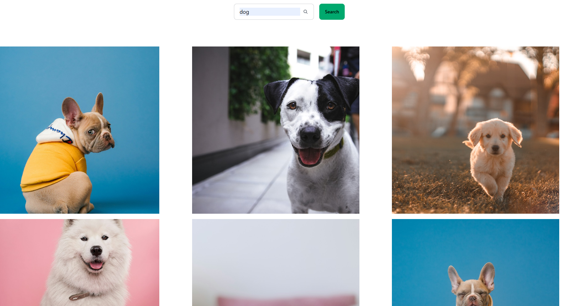

# 🔍 Simple Web Search App

A clean and minimal web search UI built with **Vite** and **Tailwind CSS**. This project showcases how to create a lightweight, fast, and responsive search interface using modern frontend tools.

 
 
 

---

## 🚀 Tech Stack

- **Vite** – Lightning-fast dev server and build tool
- **Tailwind CSS** – Utility-first CSS framework
- **HTML + JS** – Core technologies for the structure and logic

